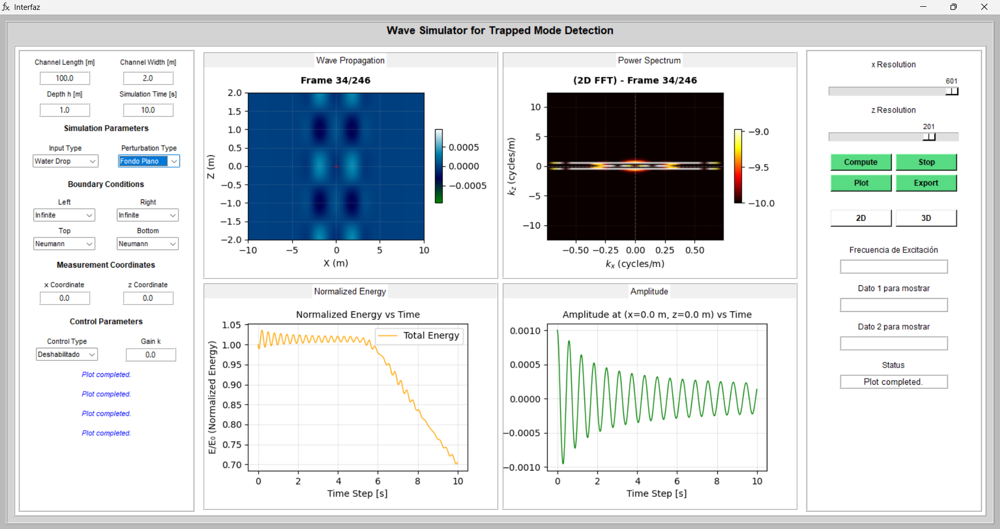
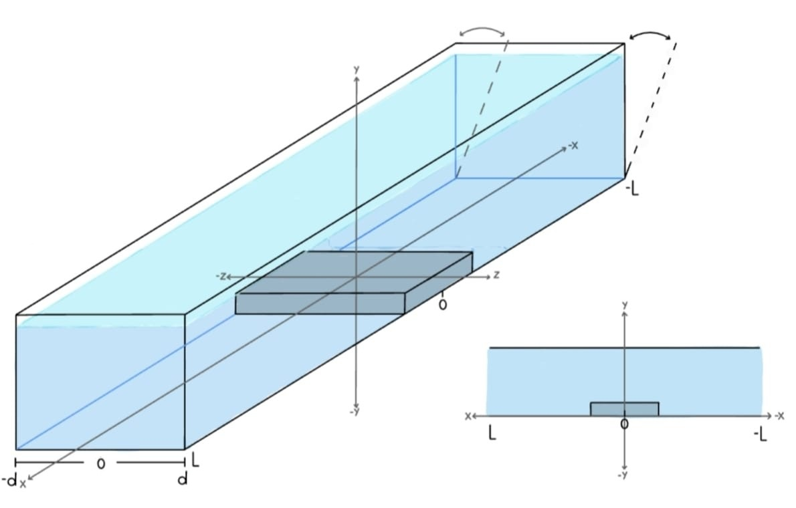
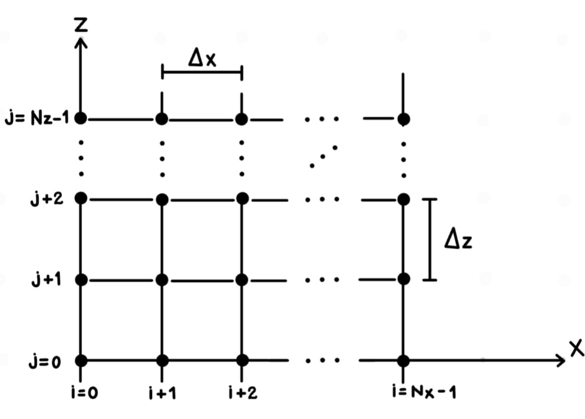

# Wave Simulator for Trapped Mode Detection

This project provides a graphical user interface for simulating wave propagation in a channel. It allows the analysis of spatial, temporal, and spectral behavior of waves under different physical configurations and boundary conditions.

We invite you to explore different perturbation types and observe how trapped modes emerge when the channel approaches infinite length—wave patterns that remain localized near the bottom perturbation, unable to escape the region.

## Table of Contents
- [Features](#features)
- [System Requirements](#system-requirements)
- [Installation](#installation)
- [Quick Start](#quick-start)
- [Mathematical Model](#mathematical-model)
- [Project Structure](#project-structure)
- [Interface Usage](#interface-usage)
  - [1. Channel Parameters](#1-channel-parameters)
  - [2. Simulation Parameters](#2-simulation-parameters)
  - [3. Boundary Conditions](#3-boundary-conditions)
  - [4. Measurement Coordinates](#4-measurement-coordinates)
  - [5. Control Action](#5-control-action)
  - [6. Spatial Resolution](#6-spatial-resolution)
  - [7. Running the Simulation](#7-running-the-simulation)
  - [8. Results Visualization](#8-results-visualization)
  - [9. Exporting Results](#9-exporting-results)
- [Examples](#examples)
- [Troubleshooting](#troubleshooting)
- [License](#license)

---

## Features

- 2D/3D wave propagation visualization
- Multiple boundary condition types (Dirichlet, Neumann, Open, Absorbing, Infinite)
- Variable bathymetry (Flat, Rectangular, Smooth Crest, Gaussian)
- Real-time energy monitoring
- Power spectrum analysis (2D FFT)
- Velocity feedback control for trapped mode stabilization
- GIF export for animations
- Adjustable spatial resolution

---

## System Requirements

- **Python**: 3.8 or higher
- **Operating System**: Windows, macOS, or Linux
- **RAM**: Minimum 4 GB (8 GB recommended for high-resolution simulations)
- **Display**: 1400x700 pixels minimum resolution

---

## Installation

### 1. Clone the Repository

```bash
git clone https://github.com/yourusername/TrappedModesPy.git
cd TrappedModesPy/trappedmodes
```

### 2. Install Dependencies

```bash
pip install -r Requirements.txt
```

This will install:
- `numpy>=1.24.0` - Numerical computing
- `matplotlib>=3.7.0` - Plotting and visualization
- `Pillow>=9.5.0` - GIF export support

**Note:** `tkinter` is included with most Python installations. If missing, install via:
- **Ubuntu/Debian**: `sudo apt-get install python3-tk`
- **macOS**: Included with Python from python.org
- **Windows**: Included with standard Python installation

### 3. Run the Simulator

```bash
python Main.py
```

---

## Quick Start

1. **Launch the application**: Run `python Main.py`
2. **Set basic parameters**:
   - Channel Length: 10 m
   - Depth: 1 m
   - Simulation Time: 10 s
   - Select "Water Drop" as input type
   - Choose "Flat Bottom" for initial testing
3. **Click "Compute"** and wait for calculation to complete
4. **Select visualization mode** (2D/3D)
5. **Click "Plot"** to view results
6. **Optional**: Click "Export" to save animation as GIF

---

## Project Structure

```
trappedmodes/
│
├── Main.py                 # Main application GUI
├── Main_Copy.py           # Backup/alternative version
├── Requirements.txt       # Python dependencies
├── readme.md             # This file
│
├── Source/               # Core computation modules
│   ├── __init__.py      # Package initialization
│   ├── calculos.py      # Wave equation solver
│   ├── perturbation.py  # Bathymetry functions
│   └── Logo3.ico        # Application icon
│
├── Images/              # Documentation images
│   ├── Interfaz.png
│   ├── Chanel.jpg
│   └── ...
│
└── Output/              # Exported simulations (auto-generated)
    └── simulation_YYYYMMDD_HHMMSS/
        ├── simulation_parameters.txt
        ├── wave_propagation.gif
        ├── energy_history.png
        └── power_spectrum.gif
```

---

## Mathematical Model

The simulator solves the shallow water wave equation with variable bathymetry:

$$\phi_{tt} - g\nabla \cdot (H(x, z)\nabla\phi) = f_{\text{control}}(x, z, t) \quad (x, z) \in \Omega$$

where:
- $\phi(x, z, t)$ — Potential representing the wave field
- $g$ — Gravitational acceleration (9.81 m/s²)
- $H(x, z)$ — Variable channel depth (bathymetry)
- $f_{\text{control}}(x, z, t)$ — External forcing term
- $\Omega$ — Computational domain

This equation models surface gravity waves in shallow water, capturing the interaction between wave propagation and bottom topography that can lead to trapped modes.

---

## User Interface

<div align="center">
  
  <p><em>Figure: Main interface of the wave simulator showing parameter controls and visualization panel</em></p>
</div>


To use the wave simulator, follow the steps described below. The interface has been designed to provide a clear and sequential workflow.

---

## Interface Usage

### 1. Channel Parameters

Set the physical and temporal parameters of the channel:

- Channel length [m]
- Channel width [m]
- Water depth [m]
- Simulation time [s]

Default values: 10 m, 2 m, 1 m, and 10 s respectively.

<div align="center">
  
  <p><em>Figure: Channel domain schematic</em></p>
</div>

These parameters can be modified according to the desired scenario.

*** 

### 2. Simulation Parameters

Next, configure the physical characteristics of the simulation:

#### Input type: defines the initial condition of the system.
For example, the “Water drop” option represents a drop falling at the center of the channel.

#### Bottom perturbation type: selects the geometry of the channel bottom. 
(Flat bottom, Rectangular perturbation, Smooth crest and Gaussian perturbation)

<div align="center">
  
  <p><em>Figure: Comparison of channel depth profiles for different perturbation types (ε = 0.5)</em></p>
</div>

*** 

### 3. Boundary Conditions

Select the boundary conditions for each side of the domain:
- **Left boundary** (x = -L)
- **Right boundary** (x = +L)
- **Upper boundary** (z = +d)
- **Lower boundary** (z = -d)

#### Available Boundary Condition Types

| Type | Mathematical Form | Physical Meaning |
|------|-------------------|------------------|
| **Dirichlet** | $\phi = 0$ | Rigid wall (perfect reflection) |
| **Neumann** | $\frac{\partial\phi}{\partial n} = 0$ | Reflective wall (no flux) |
| **Open** | One-way wave equation + damping | Radiation condition (minimal reflection) |
| **Absorbing** | $\phi_{boundary} = 0.9 \cdot \phi_{interior}$ | Weak absorption (90% transmission) |
| **Absorbing2** | $\phi_{boundary} = 0.8 \cdot \phi_{interior}$ | Strong absorption (80% transmission) |
| **Infinite** | Open + enhanced damping | Far-field approximation |

**Usage guidelines:**
- **For closed channels:** Use Dirichlet or Neumann on all boundaries
- **For open channels:** Use Open/Infinite on left and right boundaries
- **For trapped mode studies:** Use reflective conditions (Dirichlet/Neumann) to confine energy
- **To minimize reflections:** Use Absorbing or Infinite conditions

**Important:** These settings strongly influence wave behavior inside the channel. Reflective boundaries enable trapped modes, while absorbing boundaries allow energy to escape.

*** 

### 4. Measurement Coordinates

The interface allows the user to define a specific point within the domain using:

- x-coordinate
- z-coordinate

At this location, the wave amplitude can be monitored over time.

*** 

### 5. Control Action

The simulator includes optional control strategies to stabilize the wave system:

- **Disabled**: No control applied (free wave evolution)
- **Velocity Feedback**: Damping control based on velocity measurements

For active control, specify the control gain $k$ to adjust the damping strength.

#### Velocity Feedback Stabilization

This strategy stabilizes the system by applying a control force proportional to the wave velocity at the channel center, effectively introducing localized damping.

**Controlled wave equation:**

$$\phi_{tt} - g\nabla \cdot (H(x, z)\nabla\phi) = f_{\text{control}}(x, z, t) \quad (x, z) \in \Omega$$

**Control force:**

$$f_{\text{control}}(x, z, t) = -k \frac{\partial\phi}{\partial t} \cdot \delta(x - x_a, z - z_a)$$

where $(x_a, z_a)$ is the actuator location at the channel center.

**Physical mechanism:**  
The term $k\phi_t$ introduces energy dissipation at the actuator location, acting as a viscous force that opposes wave motion (analogous to friction in mechanical systems). The coefficient $k$ determines the rate of energy dissipation.

**Discrete implementation:**

$$f_{\text{control}}^n \approx -k \left(\frac{\phi^n_{i_a,j_a} - \phi^{n-1}_{i_a,j_a}}{\Delta t}\right) \delta(i_a, j_a)$$

where $(i_a, j_a) = (N_x/2, N_z/2)$ are the grid indices corresponding to the actuator at the channel center.

*** 

### 6. Spatial Resolution


On the right-hand panel, sliders are provided to define the spatial discretization:

- **Resolution in x** ($N_x - 1$): Number of grid intervals along the channel
- **Resolution in z** ($N_z - 1$): Number of grid intervals across the channel width

The computational domain is discretized using $N_x \times N_z$ grid points. Higher resolution improves accuracy but increases computational cost.

<div align="center">
  
  <p><em>Figure: Spatial discretization mesh in the x-z plane</em></p>
</div>

*** 

### 7. Running the Simulation

Once all parameters are set, follow these steps:

1. Click Calculate to run the numerical simulation.
(When the process finishes, a message will indicate that the calculation is complete.)
2. Select the visualization mode (2D or 3D).
3. Click Plot to display the results.

*** 

### 8. Results Visualization
The interface displays four main plots:

- Wave propagation
- Fourier transform (power spectrum)
- Normalized energy versus time
- Amplitude

These plots allow both temporal and spectral analysis of the wave dynamics.

*** 

### 9. Exporting Results

The Export button allows saving the simulation as an animated video (GIF format) for further analysis or documentation.

<div align="center">
  
  <p><em>Figure: Example of exported simulation showing wave propagation and interaction with bottom perturbations</em></p>
</div>

The exported animation can be used in presentations, technical reports, or for detailed time-series analysis.

---

## Examples

### Example 1: Trapped Mode Detection (Rectangular Perturbation)

**Objective:** Observe standing wave patterns caused by a rectangular bathymetry perturbation.

**Parameters:**
- Channel Length: 10 m
- Channel Width: 2 m
- Depth: 1 m
- Simulation Time: 15 s
- Input Type: Water Drop
- Perturbation Type: **Rectangular**
- Boundary Conditions: Neumann (all sides)
- Resolution: 301 × 201

**Expected Result:** Energy remains trapped near the perturbation, creating persistent oscillations. The power spectrum shows dominant frequencies corresponding to trapped modes.

---

### Example 2: Open Channel with Infinite Boundaries

**Objective:** Simulate wave propagation with minimal reflections (far-field approximation).

**Parameters:**
- Channel Length: 100 m (auto-adjusted)
- Channel Width: 2 m
- Depth: 1 m
- Simulation Time: 20 s
- Input Type: Gaussian
- Perturbation Type: Flat Bottom
- Boundary Conditions: **Infinite** (left and right), Neumann (top and bottom)
- Resolution: 601 × 201

**Expected Result:** Waves propagate outward with minimal reflection. Energy decays over time as waves exit the domain.

---

### Example 3: Velocity Feedback Control

**Objective:** Stabilize trapped modes using active control.

**Parameters:**
- Channel Length: 10 m
- Channel Width: 2 m
- Depth: 1 m
- Simulation Time: 20 s
- Input Type: Water Drop
- Perturbation Type: Smooth Crest
- Boundary Conditions: Neumann (all sides)
- Control Type: **Velocity Feedback**
- Gain k: 0.5
- Measurement Coordinates: (0.0, 0.0)

**Expected Result:** Normalized energy decreases over time due to control action. The amplitude plot shows exponential decay.

---

## Troubleshooting

### Common Issues and Solutions

#### 1. **Error: "No module named 'tkinter'"**

**Solution:**
- **Linux**: `sudo apt-get install python3-tk`
- **macOS**: Install Python from python.org (includes tkinter)
- **Windows**: Reinstall Python with "tcl/tk and IDLE" option checked

---

#### 2. **Simulation runs slowly / High memory usage**

**Causes:**
- High spatial resolution (Nx, Nz > 500)
- Long simulation time
- Multiple visualizations open

**Solutions:**
- Reduce resolution using sliders (try 201 × 151)
- Decrease simulation time
- Close plot windows before running new simulations
- Use 2D mode instead of 3D

---

#### 3. **"list index out of range" error when plotting**

**Cause:** Attempting to plot without running calculation first.

**Solution:** Always click "Compute" before "Plot".

---

#### 4. **Animation freezes or doesn't update**

**Cause:** Previous animations still running in background.

**Solution:** Click the "Stop" button before starting a new plot, or restart the application.

---

#### 5. **Energy becomes NaN or infinite**

**Causes:**
- Time step too large (violates CFL condition)
- Extremely high gain in velocity feedback control

**Solutions:**
- Reduce simulation time step (automatically computed, but affected by resolution)
- Decrease control gain k
- Check for invalid input parameters (negative values)

---

#### 6. **Exported GIF file is too large**

**Cause:** High resolution and many frames.

**Solutions:**
- Reduce spatial resolution
- Decrease simulation time (fewer frames)
- Use external tools to compress GIF after export

---

## License

This project is licensed under the **MIT License**.

```
MIT License

Copyright (c) 2025 [Your Name/Institution]

Permission is hereby granted, free of charge, to any person obtaining a copy
of this software and associated documentation files (the "Software"), to deal
in the Software without restriction, including without limitation the rights
to use, copy, modify, merge, publish, distribute, sublicense, and/or sell
copies of the Software, and to permit persons to whom the Software is
furnished to do so, subject to the following conditions:

The above copyright notice and this permission notice shall be included in all
copies or substantial portions of the Software.

THE SOFTWARE IS PROVIDED "AS IS", WITHOUT WARRANTY OF ANY KIND, EXPRESS OR
IMPLIED, INCLUDING BUT NOT LIMITED TO THE WARRANTIES OF MERCHANTABILITY,
FITNESS FOR A PARTICULAR PURPOSE AND NONINFRINGEMENT. IN NO EVENT SHALL THE
AUTHORS OR COPYRIGHT HOLDERS BE LIABLE FOR ANY CLAIM, DAMAGES OR OTHER
LIABILITY, WHETHER IN AN ACTION OF CONTRACT, TORT OR OTHERWISE, ARISING FROM,
OUT OF OR IN CONNECTION WITH THE SOFTWARE OR THE USE OR OTHER DEALINGS IN THE
SOFTWARE.
```

**Last Updated:** December 2025  
**Version:** 1.0